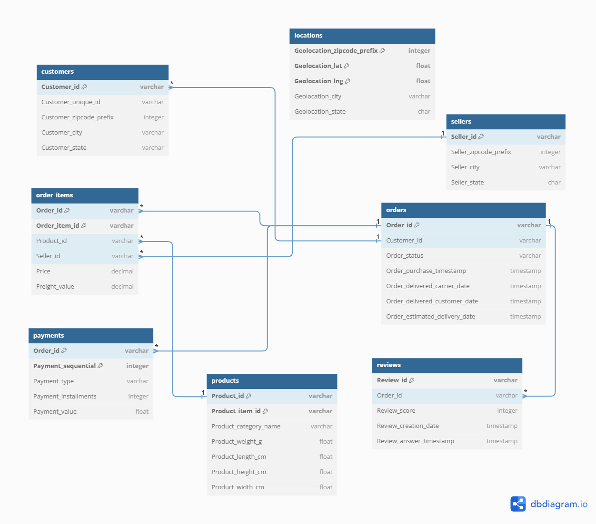

# 🛒 E-COMMERCE DATA ANALYSIS
- 브라질 이커머스 데이터셋을 사용하여 진행한 데이터 분석 프로젝트입니다.
(https://dacon.io/competitions/official/236248/overview/description)
- Python, SQL, Tableau를 사용하여 데이터를 분석하고 Dashboard로 구현하였습니다.
- Dashboard에는 현황 및 문제점을 파악하고 해결방안을 제시하는 과정이 포함됩니다.
## 🛒 DATA RELATIONSHIP DIAGRAM
- 총 8개로 구성된 데이터셋(테이블)을 ERD(Entity Relationship Diagram)로 보여줍니다.
- ERD는 dbdiagram.io에서 만들었습니다.  

